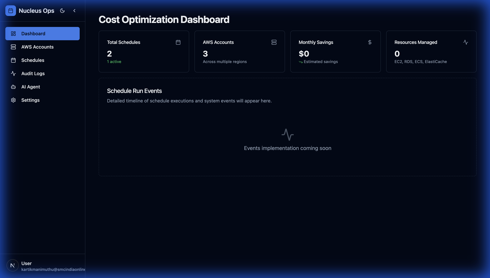
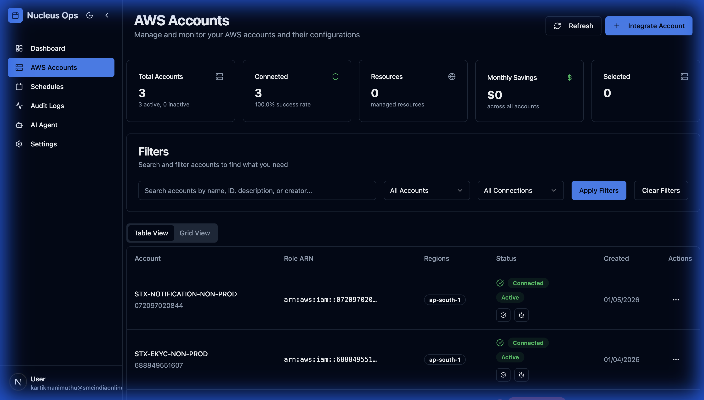
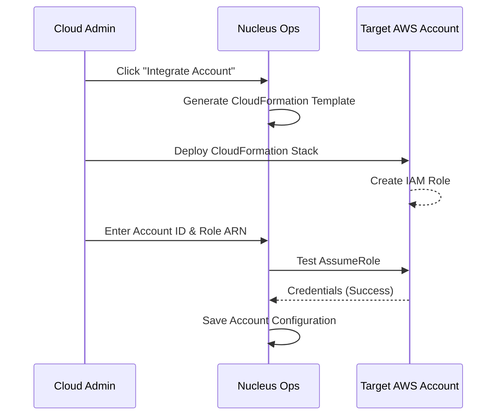
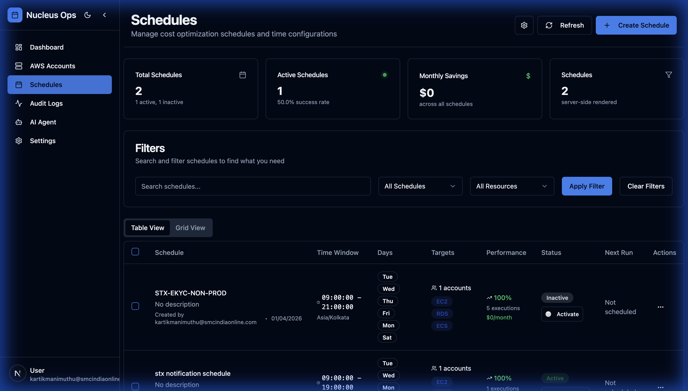
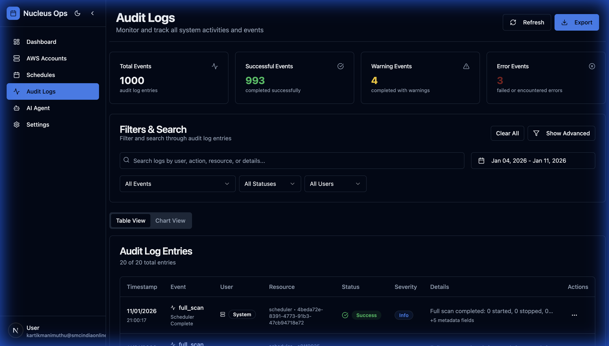
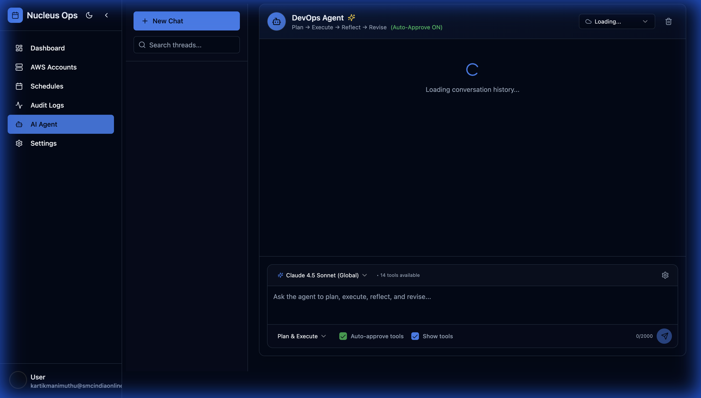

# Nucleus Ops - Features Guide

Nucleus Ops is a comprehensive AWS cost optimization platform that helps organizations reduce cloud spending by automatically managing resource states. This guide covers all features with practical examples.

## Table of Contents

1. [Dashboard](#dashboard)
2. [AWS Accounts Management](#aws-accounts-management)
3. [Schedule Management](#schedule-management)
4. [Audit Logs](#audit-logs)
5. [AI DevOps Agent](#ai-devops-agent)
6. [Settings & Customization](#settings--customization)

---

## Dashboard

The Cost Optimization Dashboard provides a centralized view of your entire scheduling operation.



### Key Metrics

| Metric | Description |
|--------|-------------|
| **Total Schedules** | Number of configured schedules across all accounts |
| **Active Schedules** | Schedules currently enabled and running |
| **AWS Accounts** | Connected AWS accounts being managed |
| **Monthly Savings** | Estimated cost savings based on schedule configurations |
| **Resources Managed** | Total EC2, RDS, and ECS resources under management |

### Schedule Run Events

Real-time activity feed showing:
- Schedule executions (start/stop operations)
- Scan completions
- Error events requiring attention

### Use Cases

**✅ Executive Overview**
> As a Cloud Operations Manager, use the dashboard for a daily health check of cost optimization initiatives across multiple AWS accounts.

**✅ Cost Tracking**
> Monitor cumulative savings and identify opportunities by seeing which accounts contribute most to savings.

---

## AWS Accounts Management

Integrate and manage multiple AWS accounts from a single interface.



### Features

#### Account Integration
1. **CloudFormation Template Generation**: Auto-generate IAM role templates
2. **One-Click Deployment**: Copy CloudFormation template for target account
3. **Connection Verification**: Test assume-role capability before saving

#### Account Details
- **Account ID**: AWS account identifier
- **Role ARN**: Cross-account IAM role for operations
- **Region**: Active AWS region for resource discovery
- **Status**: Real-time connection health
- **Resource Count**: Number of manageable resources discovered

### Integration Workflow



### Use Cases

**✅ Multi-Account Management**
> Manage development, staging, and production accounts separately with distinct schedules per environment.

**✅ Compliance & Security**
> Each account integration uses least-privilege IAM roles—no permanent credentials stored.

**✅ Resource Discovery**
> Automatically scan accounts to discover EC2 instances, RDS databases, and ECS services eligible for scheduling.

---

## Schedule Management

Create and manage automated start/stop schedules for AWS resources.



### Schedule Configuration

| Field | Description | Example |
|-------|-------------|---------|
| **Name** | Descriptive schedule identifier | "Dev Environment - Business Hours" |
| **Time Window** | Start and end times (24h format) | 09:00 - 21:00 |
| **Active Days** | Days of week when schedule runs | Mon-Fri |
| **Timezone** | Schedule timezone | Asia/Kolkata |
| **Target Accounts** | AWS accounts included | STX-EKYC-NON-PROD |
| **Resource Types** | EC2, RDS, ECS | EC2, RDS |

### Resource Selection

After defining timing, select specific resources:

1. **Full Scan**: Discover all eligible resources in selected accounts
2. **Partial Scan**: Scan specific resource types only
3. **Manual Selection**: Pick individual resources from scan results

### Schedule Actions

| Action | Description |
|--------|-------------|
| **Activate/Deactivate** | Toggle schedule without deleting |
| **Execute Now** | Manually trigger schedule evaluation |
| **Edit** | Modify timing or resource selection |
| **Delete** | Remove schedule permanently |
| **View History** | See past executions and results |

### Use Cases

**✅ Non-Production Cost Savings**
> Schedule development environments to run only during business hours (9 AM - 6 PM), saving 62% on compute costs.

**Example Configuration:**
```
Schedule: "Dev Environment Weekdays"
Start Time: 09:00
End Time: 18:00
Days: Monday - Friday
Timezone: Asia/Kolkata
Resources: 12 EC2 instances, 3 RDS databases
Estimated Savings: $2,400/month
```

**✅ Weekend Shutdown**
> Stop all non-critical resources on weekends to maximize savings.

**✅ Holiday Schedules**
> Create special schedules for extended holidays or maintenance windows.

---

## Audit Logs

Complete visibility into all platform activities for compliance and troubleshooting.



### Event Categories

| Category | Examples |
|----------|----------|
| **User Actions** | Create/Update Schedule, Integrate Account, Execute Schedule |
| **System Actions** | Scheduled Execution, Resource Start/Stop, Scan Completion |
| **Warnings** | Partial Failures, Rate Limiting, Timeout Events |
| **Errors** | Access Denied, Invalid Credentials, Resource Not Found |

### Filtering & Search

- **Text Search**: Find logs by resource name, action, or details
- **Status Filter**: Success, Warning, Error
- **User Filter**: Filter by operator
- **Date Range**: Custom time window selection
- **Advanced Filters**: Expand for granular filtering

### Audit Log Entry Details

Each entry includes:
- **Timestamp**: Exact time of event
- **Event Type**: Action performed
- **User**: Human or "System" for automated actions
- **Resource**: Affected schedule, account, or service
- **Status**: Success/Warning/Error
- **Details**: Expanded JSON with full context

### Use Cases

**✅ Compliance Reporting**
> Generate audit reports for SOC 2 compliance showing all resource modifications and access patterns.

**✅ Incident Investigation**
> Trace unexpected resource states back to specific schedule executions or manual interventions.

**✅ Operational Monitoring**
> Monitor success rates across schedules to identify problematic configurations.

---

## AI DevOps Agent

An intelligent assistant powered by Claude 4.5 Sonnet for natural language cloud management.



### Capabilities

The DevOps Agent uses a **Plan → Execute → Reflect → Revise** workflow:

1. **Planning**: Creates a step-by-step plan for complex requests
2. **Execution**: Runs AWS CLI commands and other tools
3. **Reflection**: Evaluates output quality and completeness
4. **Revision**: Improves results based on reflection

### Available Tools

| Tool | Capability |
|------|------------|
| **AWS CLI** | Execute any AWS CLI command with cross-account credentials |
| **File Operations** | Read, write, and list files |
| **Web Search** | Search the internet for documentation and solutions |
| **Shell Commands** | Run system commands for diagnostics |

### Suggested Tasks

Quick-start prompts for common operations:

> 📊 "Review the Cost of the AWS Account for the last 3 months"

> 🔍 "Check my AWS Lambda functions and their configurations"

> 📝 "Generate a security audit report for my S3 buckets"

> ⚡ "Analyze EC2 instance utilization and recommend right-sizing"

### Example Conversation

**User**: "Analyze the cost breakdown for account STX-EKYC-NON-PROD for the last 30 days"

**Agent Response**:
```
📋 Plan:
1. Get AWS credentials for the target account
2. Query AWS Cost Explorer for 30-day breakdown
3. Analyze by service and usage type
4. Generate recommendations

🔧 Execution:
Running: aws ce get-cost-and-usage --profile XYZ ...

📊 Results:
| Service    | Cost      | % of Total |
|------------|-----------|------------|
| EC2        | $1,245.00 | 45%        |
| RDS        | $890.00   | 32%        |
| S3         | $234.00   | 8%         |
| Lambda     | $89.00    | 3%         |
| Other      | $342.00   | 12%        |

💡 Recommendations:
- Consider Reserved Instances for EC2 (potential 40% savings)
- RDS Multi-AZ can be disabled for non-prod
```

### Configuration Options

| Option | Values | Description |
|--------|--------|-------------|
| **Model** | Claude 4.5 Sonnet, Claude 3.5 | AI model selection |
| **Auto-Approve** | ON/OFF | Skip confirmation for tool execution |
| **Account Context** | Dropdown | Active AWS account for operations |

### Use Cases

**✅ Cost Analysis**
> Natural language queries about AWS spending without writing AWS CLI commands.

**✅ Security Audits**
> "Find all S3 buckets with public access in my account"

**✅ Troubleshooting**
> "Why is my Lambda function timing out?" → Agent investigates logs and configuration.

**✅ Documentation**
> "Generate a markdown report of all EC2 instances with their tags"

---

## Settings & Customization

Personalize the Nucleus Ops experience.


### Appearance Settings

#### Theme Mode
- **Light**: Clean light interface
- **Dark**: Eye-friendly dark mode (default)
- **System**: Match OS preference

#### Color Schemes
Choose from 10 accent color options:
- Zinc, Slate, Stone (Neutral)
- Red, Rose, Orange (Warm)
- Green, Blue, Violet, Yellow (Vibrant)

#### Typography
- **Inter** (Default): Modern, readable
- **Manrope**: Geometric, technical
- **System**: Native OS fonts

#### Border Radius
Customize UI element roundness from sharp (0) to fully rounded (1).

### Profile Settings

- Update display name
- Change email address
- Manage profile picture

### Notification Preferences

- Email notifications for schedule failures
- Browser notifications for real-time events
- Digest frequency (immediate, daily, weekly)

### Security Settings

- Change password
- Enable 2FA (if configured)
- View active sessions
- Revoke API keys

---

## Best Practices

### Schedule Design

1. **Start Conservative**: Begin with fewer resources and expand
2. **Buffer Time**: Add 15-30 minutes buffer around business hours
3. **Test First**: Use "Execute Now" to validate before activation
4. **Monitor Closely**: Check audit logs after initial deployment

### Account Management

1. **Least Privilege**: Only grant required IAM permissions
2. **Regular Audits**: Review connected accounts monthly
3. **Naming Convention**: Use descriptive account names for clarity

### AI Agent Usage

1. **Be Specific**: Detailed prompts yield better results
2. **Verify Actions**: Review agent's plan before auto-approval
3. **Iterate**: Use follow-up questions to refine results

---

## Getting Help

- **Documentation**: `/docs` folder in repository
- **Issues**: GitHub Issues for bug reports
- **Audit Trail**: Check Audit Logs for troubleshooting
