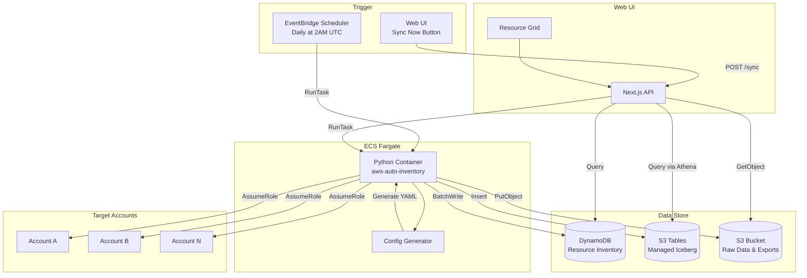

# Technical Requirements Document (TRD)
# AWS Auto-Discovery Module

**Version**: 2.1  
**Date**: January 31, 2026  
**Status**: Draft - Pending Review

---

## 1. Architecture Overview

The Auto-Discovery module introduces an event-driven architecture using **ECS Fargate** for long-running scans with AWS Auto Inventory. Data flows from target AWS accounts to **DynamoDB** (for fast UI queries) and **AWS S3 Tables** (managed Apache Iceberg for analytics).

### High-Level Architecture



---

## 2. Component Design

### 2.1 Discovery ECS Fargate Task

**Runtime**: Python 3.11 (Docker container)  
**CPU**: 1 vCPU  
**Memory**: 2048 MB  
**Timeout**: No limit (ECS supports long-running tasks)  
**Trigger**: EventBridge Scheduler (RunTask) + API (manual)

#### Directory Structure
```
lambda/discovery/
├── src/
│   ├── main.py                 # ECS task entry point
│   ├── config_generator.py     # Dynamic config from DynamoDB accounts
│   ├── inventory_runner.py     # Wrapper for aws-auto-inventory
│   ├── data_processor.py       # Parse JSON → DynamoDB items
│   ├── s3_tables_writer.py     # Write to S3 Tables (Iceberg)
│   ├── s3_raw_writer.py        # Write raw JSON to S3
│   └── utils/
│       ├── credentials.py      # STS AssumeRole helpers
│       └── logger.py           # Structured logging
├── tests/
│   ├── test_main.py
│   └── test_data_processor.py
├── requirements.txt            # aws-auto-inventory, boto3, pyiceberg
├── Dockerfile
└── config_template.yaml
```

#### Main Logic (Pseudocode)
```python
def main():
    # 1. Parse environment variables (accountId optional)
    account_id = os.environ.get('ACCOUNT_ID')  # None = scan all
    
    # 2. Fetch accounts from DynamoDB
    accounts = get_active_accounts() if not account_id else [get_account(account_id)]
    
    # 3. Generate AWS Auto Inventory config
    config = generate_config(accounts)
    
    # 4. Execute aws-auto-inventory (can run 30+ minutes)
    results = run_inventory_scan(config)
    
    # 5. Process results
    for account, resources in results.items():
        # Write to DynamoDB (fast UI queries)
        batch_write_resources(account, resources)
        
        # Write to S3 Tables (analytics)
        write_to_s3_tables(account, resources)
        
        # Write raw JSON to S3 (archival)
        upload_raw_to_s3(account, resources)
        
        # Update account lastSyncedAt
        update_account_sync_status(account)
    
    print(f"Completed: scanned {len(accounts)} accounts")

if __name__ == "__main__":
    main()
```

### 2.2 Configuration Generator

Dynamically generates AWS Auto Inventory YAML config based on active accounts in DynamoDB.

```yaml
# Generated config_template.yaml
inventories:
  - name: nucleus-discovery-{date}
    aws:
      profile: null  # Uses ECS task role
      region:
        - us-east-1
        - us-west-2
        - eu-west-1
        - ap-south-1
      organization: false  # Role-based, not org-based
    
    sheets:
      # Compute Resources
      - name: EC2Instances
        service: ec2
        function: describe_instances
        result_key: Reservations
        flatten: Instances
      
      - name: ECSServices
        service: ecs
        function: list_services
        result_key: serviceArns
      
      - name: LambdaFunctions
        service: lambda
        function: list_functions
        result_key: Functions
      
      # Database Resources
      - name: RDSInstances
        service: rds
        function: describe_db_instances
        result_key: DBInstances
      
      - name: DynamoDBTables
        service: dynamodb
        function: list_tables
        result_key: TableNames
      
      # Storage Resources
      - name: S3Buckets
        service: s3
        function: list_buckets
        result_key: Buckets
      
      # Networking Resources
      - name: VPCs
        service: ec2
        function: describe_vpcs
        result_key: Vpcs
      
      - name: LoadBalancers
        service: elbv2
        function: describe_load_balancers
        result_key: LoadBalancers
```

---

## 3. Data Model

### 3.1 DynamoDB Schema - Resource Inventory

**Table**: Existing `nucleus-app-app-table` (Single Table Design)

#### Entity: Discovered Resource

| Attribute | Type | Pattern | Description |
|-----------|------|---------|-------------|
| `pk` | String | `ACCOUNT#{accountId}` | Partition by account |
| `sk` | String | `INVENTORY#{resourceType}#{resourceArn}` | Unique resource |
| `gsi1pk` | String | `TYPE#INVENTORY` | List all resources |
| `gsi1sk` | String | `{resourceType}#{region}#{name}` | Filter/sort |
| `gsi2pk` | String | `REGION#{region}` | Filter by region |
| `gsi2sk` | String | `{resourceType}#{lastDiscoveredAt}` | Time-based |
| `gsi3pk` | String | `RESOURCE_TYPE#{type}` | Filter by type |
| `gsi3sk` | String | `{accountId}#{resourceId}` | Account scoped |
| `resourceId` | String | - | AWS resource ID |
| `resourceArn` | String | - | Full ARN |
| `resourceType` | String | - | ec2, rds, s3, etc. |
| `name` | String | - | Name tag or identifier |
| `region` | String | - | AWS region |
| `state` | String | - | running, stopped, available |
| `tags` | Map | - | All resource tags |
| `metadata` | Map | - | Type-specific attributes |
| `lastDiscoveredAt` | String | ISO8601 | Last seen timestamp |
| `discoveryStatus` | String | - | active, missing |
| `ttl` | Number | - | Epoch for TTL |

#### Access Patterns

| Pattern | Key Condition | Use Case |
|---------|---------------|----------|
| All resources for account | `pk = ACCOUNT#{id}` | Account detail view |
| All resources | `GSI1: pk = TYPE#INVENTORY` | Inventory list |
| Resources by region | `GSI2: pk = REGION#{region}` | Region filter |
| Resources by type | `GSI3: pk = RESOURCE_TYPE#{type}` | Type filter |

### 3.2 AWS S3 Tables (Managed Iceberg)

**Table Bucket**: `nucleus-app-inventory-tables-{account}-{region}` (new bucket type for Iceberg)

#### Table: `resources`
| Column | Type | Description |
|--------|------|-------------|
| `resource_arn` | STRING | Primary key |
| `resource_id` | STRING | AWS resource ID |
| `resource_type` | STRING | ec2, rds, s3, etc. |
| `account_id` | STRING | AWS account ID |
| `region` | STRING | AWS region |
| `name` | STRING | Resource name |
| `state` | STRING | Current state |
| `tags` | MAP<STRING,STRING> | Resource tags |
| `metadata` | MAP<STRING,STRING> | Additional attributes |
| `discovered_at` | TIMESTAMP | Discovery timestamp |

**Benefits of S3 Tables:**
- Automated compaction and snapshot management
- 3x faster query performance vs self-managed
- Table-level access controls
- Integration with Athena, Redshift, QuickSight

### 3.3 S3 Raw Data Bucket

```
s3://nucleus-app-inventory-{account}-{region}/
├── raw/
│   └── year={YYYY}/month={MM}/day={DD}/
│       └── {accountId}/inventory.json
└── exports/
    └── {userId}/{timestamp}/export.xlsx
```

### 3.4 Sync Status (Account Entity Update)

Add to existing Account entity:
```json
{
  "pk": "ACCOUNT#123456789012",
  "sk": "METADATA",
  "lastSyncedAt": "2026-01-31T02:00:00Z",
  "lastSyncStatus": "success",
  "lastSyncResourceCount": 1547,
  "lastSyncDurationMs": 245000,
  "syncEnabled": true
}
```

---

## 4. API Design

### 4.1 List Resources

```
GET /api/inventory/resources
```

#### Query Parameters
| Parameter | Type | Required | Description |
|-----------|------|----------|-------------|
| `accountId` | string | No | Filter by account |
| `resourceType` | string | No | Filter by type (ec2, rds, etc.) |
| `region` | string | No | Filter by region |
| `status` | string | No | Filter by discoveryStatus |
| `search` | string | No | Search name/ID |
| `page` | number | No | Page number (default: 1) |
| `pageSize` | number | No | Items per page (default: 25) |
| `sortBy` | string | No | Sort field |
| `sortOrder` | string | No | asc or desc |

#### Response
```json
{
  "items": [
    {
      "resourceId": "i-0abc123def456",
      "resourceArn": "arn:aws:ec2:us-east-1:123456789012:instance/i-0abc123def456",
      "resourceType": "ec2",
      "name": "web-server-prod-01",
      "region": "us-east-1",
      "accountId": "123456789012",
      "accountName": "Production",
      "state": "running",
      "tags": {"Environment": "prod", "Team": "platform"},
      "lastDiscoveredAt": "2026-01-31T02:15:00Z"
    }
  ],
  "pagination": {
    "page": 1,
    "pageSize": 25,
    "totalItems": 1547,
    "totalPages": 62
  },
  "filters": {
    "resourceTypes": ["ec2", "rds", "s3", "lambda"],
    "regions": ["us-east-1", "us-west-2", "ap-south-1"],
    "accounts": [{"id": "123456789012", "name": "Production"}]
  }
}
```

### 4.2 Trigger Sync

```
POST /api/inventory/sync
```

#### Request Body
```json
{
  "accountId": "123456789012"  // Optional, null = sync all
}
```

#### Response
```json
{
  "message": "Sync triggered successfully",
  "executionId": "abc123",
  "status": "in_progress"
}
```

### 4.3 Export to Excel

```
POST /api/inventory/resources/export
```

#### Request Body
```json
{
  "filters": {
    "accountId": "123456789012",
    "resourceType": "ec2",
    "region": "us-east-1"
  },
  "columns": ["name", "resourceId", "state", "region", "tags"]
}
```

#### Response
```json
{
  "downloadUrl": "https://s3.../export.xlsx",
  "expiresAt": "2026-01-31T03:00:00Z"
}
```

### 4.4 Get Sync Status

```
GET /api/inventory/status
```

#### Response
```json
{
  "accounts": [
    {
      "accountId": "123456789012",
      "accountName": "Production",
      "lastSyncedAt": "2026-01-31T02:00:00Z",
      "lastSyncStatus": "success",
      "resourceCount": 1547,
      "syncEnabled": true
    }
  ],
  "nextScheduledSync": "2026-02-01T02:00:00Z"
}
```

---

## 5. Infrastructure (CDK)

### 5.1 Updates to computeStack.ts

All discovery infrastructure added to existing `computeStack.ts`:

```typescript
// lib/computeStack.ts (additions)

// ============================================================================
// DISCOVERY INFRASTRUCTURE
// ============================================================================

// S3 Bucket for raw inventory data and exports
const inventoryBucket = new s3.Bucket(this, `${appName}-InventoryBucket`, {
  bucketName: `${appName}-inventory-${this.account}-${this.region}`,
  lifecycleRules: [
    { expiration: cdk.Duration.days(365), prefix: 'raw/' },
  ],
  removalPolicy: cdk.RemovalPolicy.DESTROY,
});

// Note: S3 Table Bucket requires AWS SDK/CLI as CDK support is pending
// Create via AWS Console or CLI: aws s3tables create-table-bucket

// ECS Task Definition for Discovery
const discoveryTaskDef = new ecs.FargateTaskDefinition(this, `${appName}-DiscoveryTaskDef`, {
  family: `${appName}-discovery-task`,
  executionRole: ecsTaskExecutionRole,
  taskRole: discoveryTaskRole,  // New role with cross-account permissions
  cpu: 1024,
  memoryLimitMiB: 2048,
  runtimePlatform: {
    cpuArchitecture: ecs.CpuArchitecture.ARM64,
    operatingSystemFamily: ecs.OperatingSystemFamily.LINUX,
  },
});

const discoveryImage = ecs.ContainerImage.fromAsset(
  path.join(__dirname, '../lambda/discovery'),
  { platform: ecr_assets.Platform.LINUX_ARM64 }
);

discoveryTaskDef.addContainer('DiscoveryContainer', {
  image: discoveryImage,
  logging: ecs.LogDriver.awsLogs({ logGroup: discoveryLogGroup, streamPrefix: 'discovery' }),
  environment: {
    APP_TABLE_NAME: appTable.tableName,
    INVENTORY_BUCKET: inventoryBucket.bucketName,
    S3_TABLE_BUCKET: `${appName}-inventory-tables-${this.account}-${this.region}`,
  },
});

// EventBridge Scheduler for Daily Discovery (2:00 AM UTC)
new scheduler.CfnSchedule(this, `${appName}-DailyDiscoverySchedule`, {
  scheduleExpression: 'cron(0 2 * * ? *)',
  target: {
    arn: ecsCluster.clusterArn,
    roleArn: schedulerRole.roleArn,
    ecsParameters: {
      taskDefinitionArn: discoveryTaskDef.taskDefinitionArn,
      launchType: 'FARGATE',
      networkConfiguration: { ... },
    },
  },
  flexibleTimeWindow: { mode: 'OFF' },
});
```

### 5.2 IAM Permissions

```typescript
// Discovery Task Role permissions
const discoveryTaskRole = new iam.Role(this, `${appName}-DiscoveryTaskRole`, {
  assumedBy: new iam.ServicePrincipal('ecs-tasks.amazonaws.com'),
});

// Cross-account assume role
discoveryTaskRole.addToPolicy(new iam.PolicyStatement({
  actions: ['sts:AssumeRole'],
  resources: ['arn:aws:iam::*:role/NucleusAccess-*'],
}));

// DynamoDB access
discoveryTaskRole.addToPolicy(new iam.PolicyStatement({
  actions: [
    'dynamodb:Query', 'dynamodb:GetItem', 'dynamodb:PutItem',
    'dynamodb:BatchWriteItem', 'dynamodb:UpdateItem',
  ],
  resources: [appTable.tableArn, `${appTable.tableArn}/index/*`],
}));

// S3 Tables access
discoveryTaskRole.addToPolicy(new iam.PolicyStatement({
  actions: ['s3tables:*'],
  resources: [`arn:aws:s3tables:${this.region}:${this.account}:bucket/*`],
}));

inventoryBucket.grantReadWrite(discoveryTaskRole);
inventoryBucket.grantRead(ecsTaskRole);  // For web-ui export downloads
```

---

## 6. UI Components

### 6.1 Page Structure

```
app/inventory/
├── page.tsx              # Main inventory page
├── loading.tsx           # Loading skeleton
└── layout.tsx            # Inventory layout wrapper

components/inventory/
├── inventory-grid.tsx        # AG Grid / TanStack Table
├── inventory-filters.tsx     # Filter controls sidebar
├── inventory-toolbar.tsx     # Search, export, sync buttons
├── inventory-sync-status.tsx # Last synced banner
└── resource-detail-drawer.tsx # Detail panel
```

### 6.2 Grid Component Features

| Feature | Implementation |
|---------|----------------|
| Virtual scrolling | TanStack Virtual for 10k+ rows |
| Column sorting | Click headers to sort |
| Column resizing | Drag borders |
| Multi-select filters | Dropdown checkboxes |
| Search | Debounced input (300ms) |
| Pagination | Server-side with page size selector |
| Export | Button triggers POST to /export |
| Row click | Opens detail drawer |

### 6.3 State Management

```typescript
// Example: inventory store with Zustand
interface InventoryState {
  resources: Resource[];
  filters: InventoryFilters;
  pagination: Pagination;
  syncStatus: SyncStatus[];
  isLoading: boolean;
  
  fetchResources: (filters: InventoryFilters) => Promise<void>;
  triggerSync: (accountId?: string) => Promise<void>;
  exportToExcel: (filters: InventoryFilters) => Promise<string>;
}
```

---

## 7. Security Considerations

| Area | Implementation |
|------|----------------|
| **Cross-Account Access** | STS AssumeRole with `NucleusAccess-*` pattern |
| **Data Encryption** | S3 SSE-S3, DynamoDB encryption at rest |
| **API Authentication** | NextAuth.js session validation |
| **Export Security** | Pre-signed S3 URLs with 1-hour expiry |
| **Rate Limiting** | API routes: 100 req/min per user |
| **Audit Logging** | All sync triggers logged to audit table |

---

## 8. Error Handling

| Scenario | Handling |
|----------|----------|
| Lambda timeout | Log partial progress, mark sync as partial |
| AssumeRole failure | Log error, continue with other accounts |
| DynamoDB throttling | Exponential backoff (boto3 built-in) |
| Invalid resource data | Skip resource, log warning |
| S3 upload failure | Retry 3x, log if still failing |

---

## 9. Monitoring & Observability

| Metric | Source | Alert Threshold |
|--------|--------|-----------------|
| Discovery Lambda duration | CloudWatch | > 14 minutes |
| Discovery Lambda errors | CloudWatch | > 2 per day |
| DynamoDB consumed capacity | CloudWatch | > 80% provision |
| S3 upload failures | Custom metric | > 5 per run |
| Resource count delta | Custom metric | > 20% change |

---

## 10. Implementation Phases

### Phase 1: Infrastructure (Week 1)
- [ ] Create `discoveryStack.ts` with Lambda, S3, EventBridge
- [ ] Update `computeStack.ts` with new IAM permissions
- [ ] Deploy to dev environment

### Phase 2: Discovery Lambda (Week 2)
- [ ] Implement Python handler with aws-auto-inventory
- [ ] Build config generator from DynamoDB accounts
- [ ] Implement DynamoDB batch writer
- [ ] Implement S3 uploader with partitioning

### Phase 3: API Layer (Week 3)
- [ ] Create `/api/inventory/resources` with pagination
- [ ] Create `/api/inventory/sync` trigger endpoint
- [ ] Create `/api/inventory/export` with S3 pre-signed URLs
- [ ] Create `/api/inventory/status` for sync status

### Phase 4: UI (Weeks 4-5)
- [ ] Create inventory page with grid component
- [ ] Implement filter sidebar
- [ ] Implement search with debounce
- [ ] Implement export button
- [ ] Implement sync status banner
- [ ] Add to sidebar navigation

### Phase 5: Testing & Polish (Week 6)
- [ ] Unit tests for Lambda
- [ ] API integration tests
- [ ] UI component tests
- [ ] Performance testing with 10k+ resources
- [ ] Documentation

---

## 11. Related Documents

- [Product Requirements Document](./prd-auto-discovery-v2.md)
- [Architecture Guide](./ARCHITECTURE.md)
- [Schema Design](./schema-design.md)
- [AWS Auto Inventory Docs](https://github.com/aws-samples/aws-auto-inventory)
